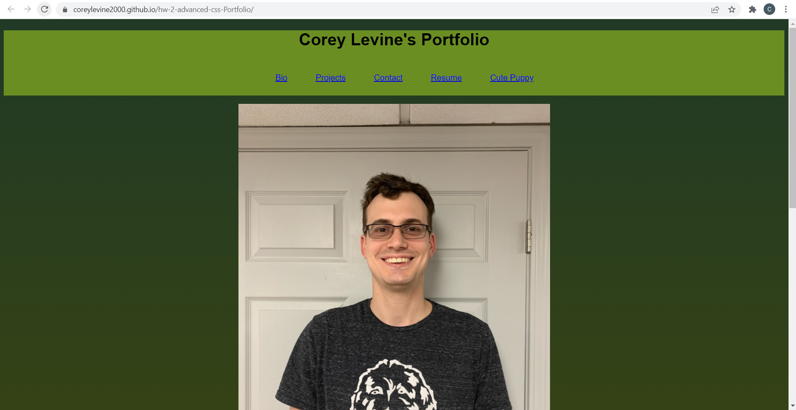
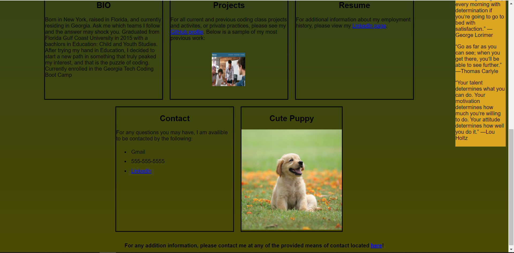

# hw-2-advanced-css-Portfolio

The following project is the first edition of my personal portfolio page, utilizing only HTML and CSS to the best of my abilities at this point in time. 

At the moment, all professional links will be updated in due time, however both links to my most recent project and my git hub account are active and functional.

As a bonus bit of fun to test media sizing, the profile image will change based on the width of the screen, coincidentlly coinciding when the column flex-wraps further down the screen

